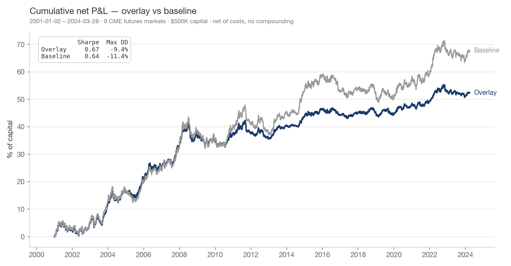
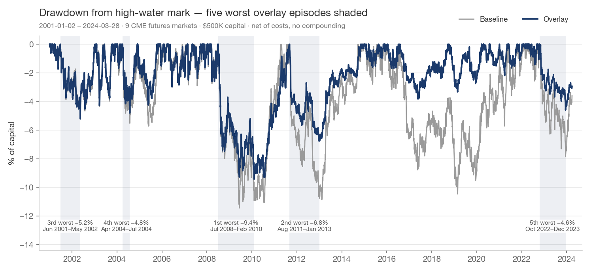
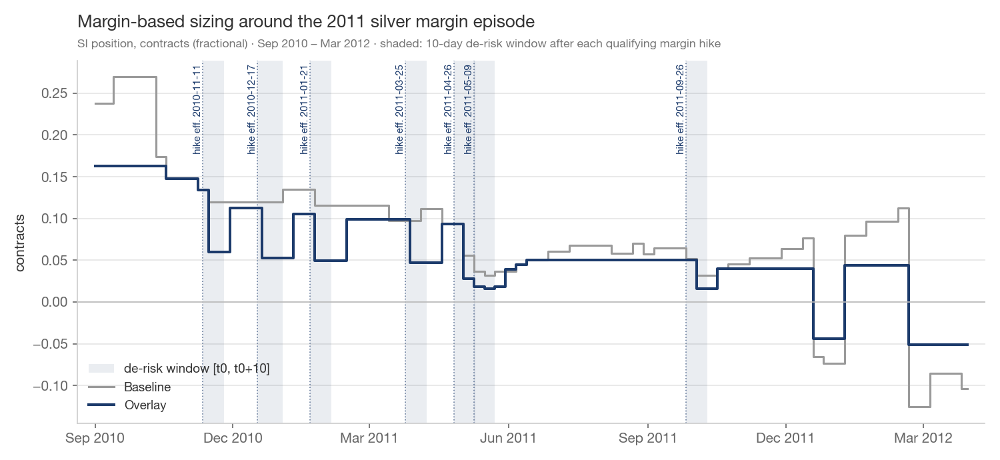
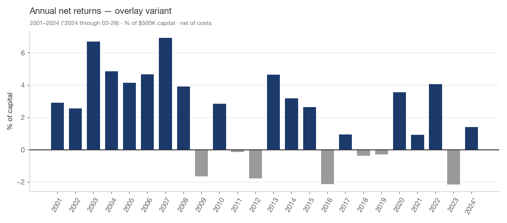
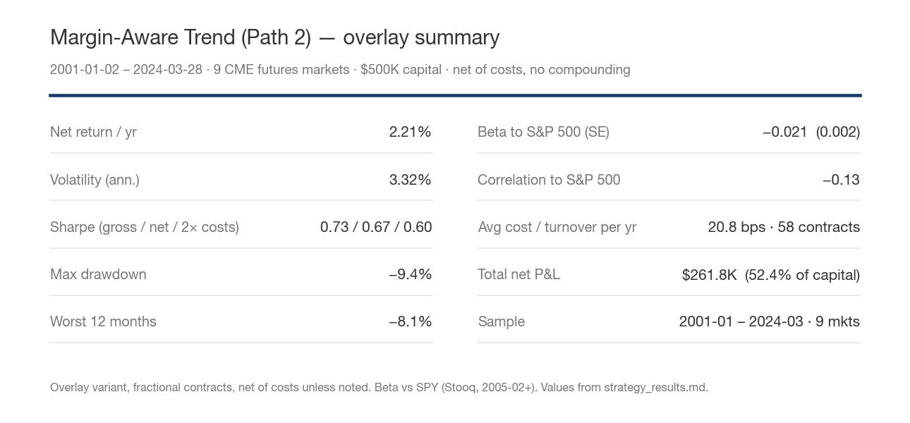

# Exhibits — Margin-Aware Trend (Path 2)

Sample 2001-01-02 – 2024-03-28, 9 CME markets, $500K capital, 10% ann. vol
target split 1/9 per market. Net = after rebalance, roll, and stress costs.
All numbers from strategy_results.md (spec: strategy_spec_v1.md); figures
generated by scripts/exhibit_restyle.py.

**Figure 1.** Cumulative net P&L, overlay vs baseline, 2001–2024, $500K.
Inset: net Sharpe and maximum drawdown per variant.

**Figure 2.** Drawdown from high-water mark, net, with the five worst overlay
episodes shaded and labeled. The overlay's maximum drawdown is −9.4% of
capital vs −11.4% for the realized-vol-only baseline.

**Figure 3.** Margin-based sizing around the 2011 silver margin episode.
Shaded bands are the 10-trading-day de-risk windows; dotted lines mark the
qualifying margin-hike effective dates.

**Figure 4.** Net return by calendar year, overlay variant (2024 through
03-28). Era dependence is visible: the strong years cluster in 2001–2008,
with thinner returns after.

**Table 1.** Summary statistics, overlay variant, factsheet format. Sharpe
shown gross / net / at doubled costs; beta and correlation vs SPY
(Stooq, 2005-02+).

**Table 2.** Sub-periods, net (ann ret / ann vol / Sharpe / max DD).

| Period | Overlay | Baseline |
|---|---|---|
| 2001–2008 | 4.54% / 4.49% / 1.01 / −7.5% | 4.70% / 4.79% / 0.98 / −8.0% |
| 2009–2014 | 1.15% / 2.83% / 0.41 / −6.8% | 2.46% / 4.24% / 0.58 / −10.9% |
| 2015–2020 | 0.71% / 2.22% / 0.32 / −3.8% | 0.69% / 4.14% / 0.17 / −10.5% |
| 2021–2024.03 | 1.28% / 2.36% / 0.54 / −4.6% | 3.11% / 4.61% / 0.67 / −7.9% |

**Table 3.** Cost decomposition, overlay variant (bps of capital per year;
sample years shown).

| Year | Rebal bps | Roll bps | Stress bps | Total bps | Contracts | Notional $M |
|---|---|---|---|---|---|---|
| 2001 | 26.6 | 24.1 | 7.1 | 57.7 | 156 | 5 |
| 2008 | 5.7 | 5.4 | 7.0 | 18.1 | 35 | 3 |
| 2020 | 6.0 | 5.2 | 1.4 | 12.6 | 36 | 4 |
| 2023 | 4.5 | 4.0 | 0.8 | 9.3 | 27 | 3 |
| **mean/yr** | 10.4 | 8.0 | 2.3 | 20.8 | 58 | 4 |
