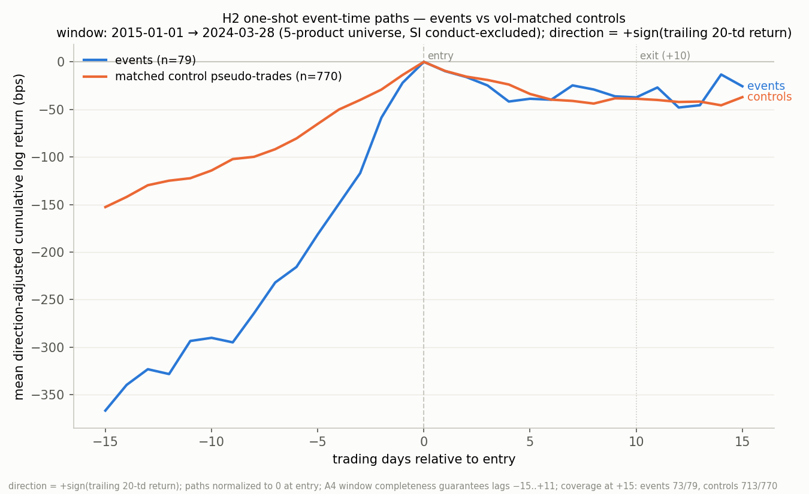

"The continuation strategy failed its preregistered one-shot test on previously untouched 2015–2024 data (C1 vol test: D = 2.1 bps vs. +15 bps; C2 cost test: G = -37.3 bps vs. +10 bps); combined with the reversal hypothesis's earlier preregistered failure, margin-increase events show no exploitable multi-day return signal in either direction, and no margin-based strategy will be pitched."

# H2 Results — Preregistration H2 v1.0, One-Shot Continuation Test

Sample window (every table below unless stated): entry dates 2015-01-01 → 2024-03-28, committed events_v3.csv, 5-product universe ZN, 6E, 6J, GC, HG (SI conduct-excluded per the Stage-1 record; attrition only). Direction: +sign(trailing 20-td return) — continuation. This sample had never been loaded, summarized, plotted, or viewed before this run; this was its single, final use (H0/H4). No amendments were made; ambiguities were resolved by the strictest reading and are logged below and in scripts/h2_oneshot.py.

## Verdict against preregistered kill criteria (H3, in order)

| Criterion | Preregistered threshold | Measured | Verdict |
|---|---|---|---|
| C1: D (event − matched-control mean) | ≥ +15 bps | 2.09 bps | FAIL |
| C2: G (mean event return, gross) | ≥ +10 bps | -37.33 bps | FAIL |
| C3: D(2021–2024.03) | ≥ +10 bps AND ≥ 40% of D(2015–2020) (= -12.72 bps) | 45.96 bps | PASS |
| C4: D excluding HG (largest \|contribution\|) | ≥ +5 bps | 29.86 bps | PASS |

- **D = 2.09 bps**, 95% interval **[-62.05, 69.05] bps** (monthly-block bootstrap, 43 blocks, 10,000 draws, seed 42).
- **G = -37.33 bps** over all 79 included events (unmatched events remain in G; they are dropped only from the matched comparison).
- Unmatched: **1/79 (1.3%)** (no A5 fragility flag; threshold 20%).
- Caliper widened once to [0.70, 1.43] for 2 events (A5 no-match protocol).
- Secondary, reported only: vol-standardized mean event return -0.030; vol-standardized matched differential 0.059 (10-day log return ÷ trailing vol·√(10/252)).

## C3 decay split (entry-date split at 2021-01-01)

| Segment | Matched events | D (bps) |
|---|---|---|
| 2015-01-01 → 2020-12-31 | 44 | -31.80 |
| 2021-01-01 → 2024-03-28 | 34 | 45.96 |

Retention: D_recent / D_early = -144.5%; thresholds: D_recent ≥ +10 bps and ≥ 40% of D_early.

## C4 concentration floor

Contribution of product p to D = Σ over p's matched events of (event − control-mean), i.e. n_p·D_p; D = Σ_p contribution_p / N_matched (strictest-reading log R6).

| Product | Matched events | D_p (bps) | Contribution Σdiff (bps) |
|---|---|---|---|
| 6E | 9 | -38.41 | -345.7 |
| 6J | 10 | -0.85 | -8.5 |
| GC | 20 | 37.40 | 748.0 |
| HG | 22 | -68.57 | -1508.6 |
| ZN | 17 | 75.19 | 1278.2 |

Largest absolute contribution: **HG**. D excluding HG: **29.86 bps** over 56 matched events (threshold ≥ +5 bps).

## Leave-one-crisis-out (fragility, non-fatal per H3)

| Dropped year (entry dates) | Events dropped | D (bps) | Sign flip vs full D |
|---|---|---|---|
| 2020 | 16 | 31.56 | no |
| 2022 | 15 | 3.72 | no |

## Per-product table

| Product | Events | Matched | Unmatched | Caliper widened | G (bps) | Control mean (bps) | D (bps) |
|---|---|---|---|---|---|---|---|
| 6E | 9 | 9 | 0 | 0 | -36.0 | 2.4 | -38.4 |
| 6J | 10 | 10 | 0 | 0 | -5.0 | -4.2 | -0.8 |
| GC | 21 | 20 | 1 | 1 | -20.0 | -50.4 | 37.4 |
| HG | 22 | 22 | 0 | 1 | -154.5 | -85.9 | -68.6 |
| ZN | 17 | 17 | 0 | 0 | 73.1 | -2.0 | 75.2 |
| **All** | 79 | 78 | 1 | 2 | -37.3 | -37.9 | 2.1 |

## Cost table (A6 model)

Model: 2 × (1 tick half-spread + 0.2 bps fees) per round trip; entry side +1 tick stress penalty. Tick specs are the committed stage2_v3.py hard-coded values (conservative for 2015–2024; log R7). Tick bps at the median sample entry price. Context only; C2's threshold is fixed at +10 bps gross.

| Product | Tick (price units) | Median entry price | 1 tick (bps) | Round trip (bps) | Stress-adjusted (bps) | G (bps) | G − stress cost (bps) |
|---|---|---|---|---|---|---|---|
| 6E | 0.0001 | 1.1237 | 0.89 | 2.18 | 3.07 | -36.0 | -39.1 |
| 6J | 1e-06 | 0.00861675 | 1.16 | 2.72 | 3.88 | -5.0 | -8.9 |
| GC | 0.1 | 1768.3 | 0.57 | 1.53 | 2.10 | -20.0 | -22.1 |
| HG | 0.0005 | 3.15 | 1.59 | 3.57 | 5.16 | -154.5 | -159.6 |
| ZN | 0.015625 | 126.484 | 1.24 | 2.87 | 4.11 | 73.1 | 69.0 |

Event-weighted pooled stress-adjusted round-trip cost (each event at its own entry price): **3.75 bps**.

## Event-time plot

Mean direction-adjusted cumulative log return (bps), lags −15..+15 trading days, normalized to 0 at entry; 79 events vs 770 matched control pseudo-trades (pooled over event–control pairs, controls reusable per A5). A4 completeness guarantees lags −15..+11; beyond +11 coverage declines (at +15: events 73/79, controls 713/770); no imputation — per-lag available means.

## Sample, attrition, and matching diagnostics

Reported before any return was computed (Part B step 1):

| Product | Events in window | Included (A4 survivors) | Excluded |
|---|---|---|---|
| 6E | 11 | 9 | 2 |
| 6J | 11 | 10 | 1 |
| GC | 22 | 21 | 1 |
| HG | 23 | 22 | 1 |
| ZN | 19 | 17 | 2 |
| **Total (5-product)** | 86 | 79 | 7 |

- Sample floor: 79 included events vs preregistered minimum 40 — PASS.
- SI (conduct-excluded in Stage 1, price-series identity unresolved): 22 events in window, 17 with complete windows — attrition only; no SILVER price was loaded and no SI return was computed in this session.
- Excluded-event reasons (5-product universe): {'selected contract missing 1 of 33 window days': 1, 'selected contract missing 1 of 33 window days (FORWARD fallback also incomplete)': 1, 'selected contract missing 2 of 33 window days (FORWARD fallback also incomplete)': 1, 'selected contract missing 3 of 33 window days (FORWARD fallback also incomplete)': 1, 'selected contract missing 4 of 33 window days (FORWARD fallback also incomplete)': 1, 'selected contract missing 6 of 33 window days (FORWARD fallback also incomplete)': 1, 'trailing return exactly zero (v1 A4 exclusion)': 1}.
- A4 completeness-fallback events in sample: 9.
- Entry-vs-effective window-membership deviations (log R2): 0.
- Control-day pools (A5, under the amended A4 selection including the completeness fallback):

| Product | Trading days in window | ±15 td of a margin change | Unselectable/incomplete | Zero trailing | Candidates | Fallback selections |
|---|---|---|---|---|---|---|
| 6E | 2381 | 626 | 338 | 4 | 1413 | 408 |
| 6J | 2436 | 817 | 281 | 4 | 1334 | 142 |
| GC | 2425 | 1244 | 177 | 1 | 1003 | 149 |
| HG | 2672 | 1323 | 18 | 10 | 1321 | 50 |
| ZN | 2428 | 1080 | 130 | 4 | 1214 | 112 |

- Matched controls per event: {10: 76, 5: 2} (k = 10 nearest by |log vol ratio|, ties to earlier dates; controls reusable).
- Distinct control days used: 673 across 770 event–control pairs.
- Stage-1 reproduction: every event's selected contract, fallback flag, trailing return, and trailing vol asserted equal to the committed events_v3.csv (log R4).

## Strictest-reading log and containment (H4)

1. **One run.** This script ran once; its printout is final. No exploratory computation of any kind was performed in this session.
2. **Containment.** The 2015-01-01 → 2024-03-28 sample was loaded for the first time ever in this run. Prices loaded 2014-10-01 → 2024-03-28 — the minimum covering [entry−21, entry+11] windows and −15..+15 plot lags of early-2015 entries and the ±15-td margin-change exclusion look-back at the boundary (log R3). Pre-2015 days are never events and never control candidates; burned pilot data entered only as A4/A5-required trailing context.
3. **Sample floor** counted included (A4-surviving) events in the 5-product universe — the events actually analyzed (log R1).
4. **C3** split by entry_date at 2021-01-01; both sub-conditions required; an empty segment would have failed C3 (log R5).
5. **C4 contribution** = additive share Σdiff (= n_p·D_p); ties (none occurred) would break toward the lower recomputed D (log R6).
6. **Ticks** reused from the committed stage2_v3.py hard-coding — conservative for this era (log R7). **G** includes unmatched events (log R10). **Bootstrap** monthly blocks, seed 42, 10,000 draws (log R11). **LOCO** by entry-date calendar year (log R9).
7. **H5 sentence** lists every failed criterion with measured value vs. threshold (log R8).
8. **Margin-change exclusion**: changes of any size and either direction; change dates snapped to the first trading day on/after the effective date. Changes before the price-calendar start cannot reach the candidate window (calendar begins 2014-10-01; candidates begin 2015-01-01).

## Genealogy and closure (H0/H4/H5)

This study's motivation was the preregistered FAILURE of the reversal hypothesis on 2000–2014 pilot data (commit ebda726: D = −17.1 bps vs +15, G = +3.1 bps vs +10). The pre-2015 data is burned; the reversal hypothesis may not be re-tested on any data. This one-shot run failed; per H4 there is no v1.1, no re-test, and no third hypothesis: no margin-based strategy of any kind will be pitched. The two-sided preregistered result — reversal dead on 2000–2014, continuation dead on 2015–2024 — is itself the finding: CME margin-increase events carry no exploitable multi-day return signal in either direction beyond volatility.
