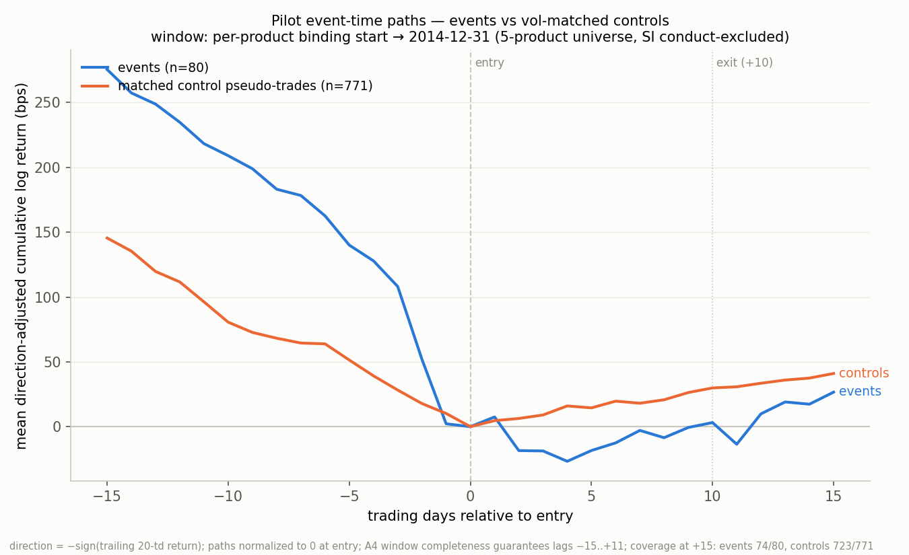

# Pilot Results — Preregistration v3.0, Stage 2 (PILOT ONLY)

"The strategy failed its preregistered test: after matching on volatility, margin increases contained no exploitable information — the event-minus-control differential was -17.1 bps against a preregistered threshold of +15 bps, meaning what looked like a margin effect is ordinary post-volatility behavior, and the strategy is dead." "The strategy failed its preregistered cost test: the gross post-event return was 3.1 bps against a preregistered threshold of +10 bps, which cannot clear transaction costs, and the strategy is dead."

## Verdict against preregistered kill criteria

Sample window (every table below): per-product binding start → 2014-12-31 (entry dates; binding starts 6E 2000-01-01, 6J 2000-02-03, ZN 2004-01-02, GC/HG 2009-01-08). Universe: ZN, 6E, 6J, GC, HG — the 5 products surviving Stage-1 K0; SI is conduct-excluded (price-series identity unresolved) and appears in the attrition table only.

| Criterion | Preregistered threshold | Measured | Verdict |
|---|---|---|---|
| K1: pilot D (event − matched-control mean) | ≥ +15 bps | -17.08 bps | FAIL |
| K2: pilot G (mean event return, gross) | ≥ +10 bps | 3.14 bps | FAIL |

- **D = -17.08 bps**, 95% interval **[-75.82, 39.27] bps** (monthly-block bootstrap, 55 blocks, 10,000 draws, seed 42).
- **G = 3.14 bps** over all 80 included pilot events (unmatched events remain in G; they are dropped only from the matched comparison).
- Unmatched: **2/80 (2.5%)** (no A5 fragility flag; threshold 20%).
- Caliper widened once to [0.70, 1.43] for 4 events (A5 no-match protocol).
- Secondary, reported only: vol-standardized mean event return 0.014; vol-standardized matched differential 0.005 (10-day log return ÷ trailing vol·√(10/252)).

## Per-product table

Window: per-product binding start → 2014-12-31.

| Product | Events | Matched | Unmatched | Caliper widened | G (bps) | Control mean (bps) | D (bps) |
|---|---|---|---|---|---|---|---|
| 6E | 23 | 23 | 0 | 0 | 23.9 | 9.3 | 14.6 |
| 6J | 25 | 23 | 2 | 3 | 17.2 | 10.4 | 35.7 |
| GC | 8 | 8 | 0 | 0 | 49.1 | 42.7 | 6.4 |
| HG | 7 | 7 | 0 | 0 | -133.9 | 224.6 | -358.5 |
| ZN | 17 | 17 | 0 | 1 | -10.8 | -9.0 | -1.8 |
| **All** | 80 | 78 | 2 | 4 | 3.1 | 28.4 | -17.1 |

## Cost table (A6 model)

Window: per-product binding start → 2014-12-31. Model: 2 × (1 tick half-spread + 0.2 bps fees) per round trip; entry side +1 tick stress penalty. Ticks are hard-coded pilot-era outright minimum price fluctuations. Tick bps computed at the median pilot entry price. Reported for context; K2's threshold is fixed at +10 bps and does not rescale to this table.

| Product | Tick (price units) | Median entry price | 1 tick (bps) | Round trip (bps) | Stress-adjusted (bps) | G (bps) | G − stress cost (bps) |
|---|---|---|---|---|---|---|---|
| 6E | 0.0001 | 1.2448 | 0.80 | 2.01 | 2.81 | 23.9 | 21.1 |
| 6J | 1e-06 | 0.009838 | 1.02 | 2.43 | 3.45 | 17.2 | 13.7 |
| GC | 0.1 | 1341.55 | 0.75 | 1.89 | 2.64 | 49.1 | 46.4 |
| HG | 0.0005 | 3.283 | 1.52 | 3.45 | 4.97 | -133.9 | -138.8 |
| ZN | 0.015625 | 114.938 | 1.36 | 3.12 | 4.48 | -10.8 | -15.3 |

Event-weighted pooled stress-adjusted round-trip cost (each event at its own entry price): **3.58 bps**.

## Event-time plot

Mean direction-adjusted cumulative log return (bps), lags −15..+15 trading days, normalized to 0 at entry; 80 events vs 771 matched control pseudo-trades (pooled over event–control pairs, controls reusable per A5). A4 completeness guarantees lags −15..+11; beyond +11 coverage declines (at +15: events 74/80, controls 723/771); no imputation — per-lag available means. Window: per-product binding start → 2014-12-31.

## Attrition and matching diagnostics

Window: per-product binding start → 2014-12-31.

- Pilot qualifying clustered events, 6 declared products (Stage-1 Gate 2 count): 93.
- SI (conduct-excluded in Stage 1, price-series identity unresolved): 13 pilot events, of which 4 had complete windows — attrition only; no SILVER price was loaded and no SI return was computed in this session.
- 5-product pilot universe: 80 events, 80 included (0 excluded in Stage 1), of which 1 used the A4 completeness fallback.
- Control-day pools (A5, under the amended A4 selection including the completeness fallback — A0.4 symmetry):

| Product | Trading days in window | ±15 td of a margin change | Unselectable/incomplete | Zero trailing | Candidates | Fallback selections |
|---|---|---|---|---|---|---|
| 6E | 3785 | 1822 | 61 | 3 | 1899 | 65 |
| 6J | 3762 | 1834 | 54 | 1 | 1873 | 70 |
| GC | 1500 | 669 | 14 | 0 | 817 | 1 |
| HG | 1615 | 607 | 0 | 5 | 1003 | 12 |
| ZN | 2760 | 1097 | 100 | 4 | 1559 | 20 |

- Matched controls per event: {10: 76, 6: 1, 5: 1} (k = 10 nearest by |log vol ratio|, ties to earlier dates; controls reusable).
- Distinct control days used: 672 across 771 event–control pairs.

## Interpretation notes (containment and spec readings)

1. **Candidate control days are restricted to the pilot window** (binding start → 2014-12-31). A5's “d within the product's analysis span” is applied jointly with A7's clause that the holdout (2015-01-01 → 2024-03-28) stays untouched until the pilot verdict is committed: pilot controls drawn from 2015+ would make the pilot verdict depend on holdout-era prices. The holdout stage mirrors this reading on its own window.
2. **Containment**: price data was loaded only through 2015-03-31 — the minimum covering the [entry−21, entry+11] windows and −15..+15 plot lags of late-December-2014 entries (event exits spill past year-end by construction; that spill is part of the preregistered design). No event dated after 2014-12-31 was loaded, filtered, summarized, or plotted. Post-2014 margin rows were consulted only as raw change dates for the A5 ±15-trading-day exclusion at the boundary.
3. **Margin-change exclusion**: changes of any size and either direction; change dates snapped to the first trading day on/after the effective date (the same snap A3 uses for entries). Changes before a product's margin-history start are unobservable; the rule filters on known changes.
4. **Pilot boundary**: by-entry-date and by-effective-date definitions coincide in this sample (93 events either way; verified before matching).
5. **Event/control construction is logic-identical to the committed Stage-1 record**: the loader and A4 selection are copied from stage1_v3.py, and every pilot event's recomputed selected contract, fallback flag, trailing return, and trailing vol were asserted equal to events_v3.csv.
6. **Reproducibility**: scripts/stage2_v3.py, numpy seed 42 (bootstrap), k = 10,000 draws, monthly blocks over matched events' entry months.

## Lock clause

Per A7 (binding, unchanged from v2): the pilot answers go/no-go only. The pilot failed; per A8 the strategy is dead and no holdout runs. PILOT_FAIL written.
